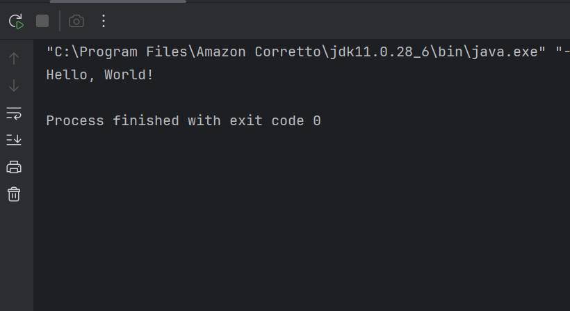
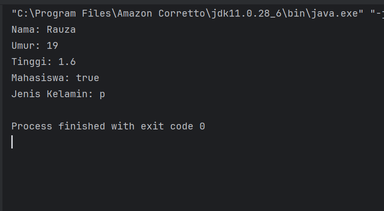
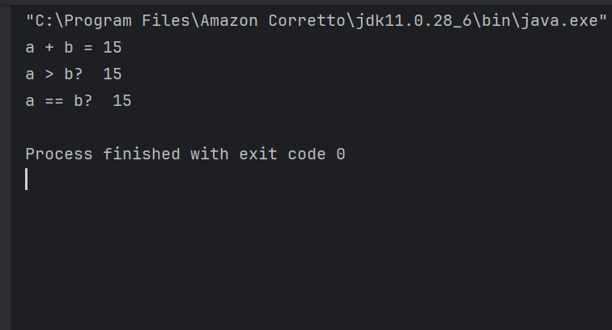
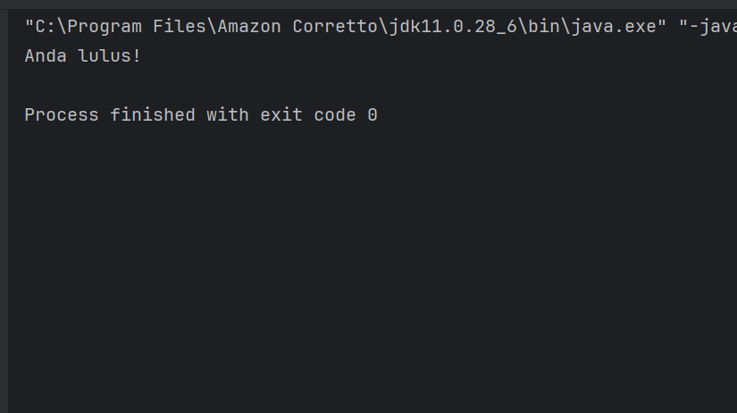
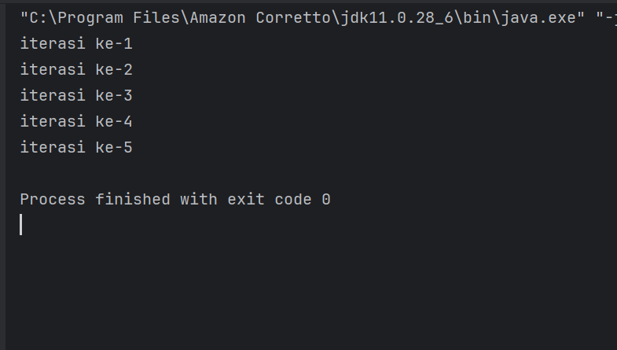
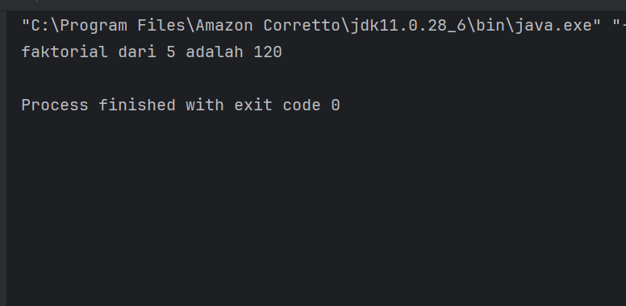
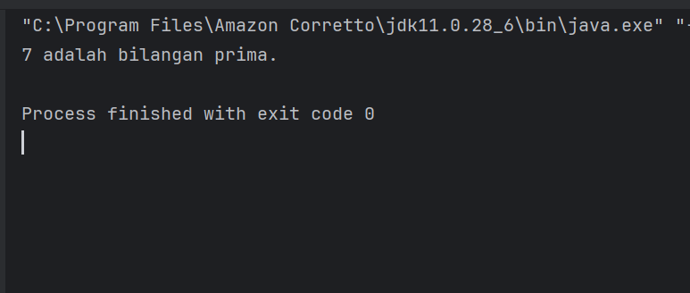
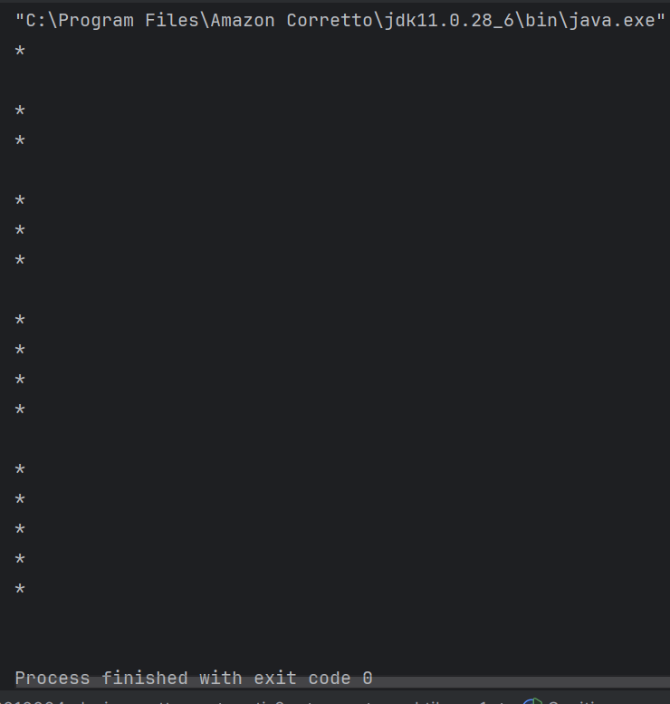

# Laporan Lab 01: Review Dasar Pemrograman Java

**Mata Kuliah:** Praktikum Design Pattern
**Nama:** Rauzatun Jannah
**NIM:** 2024573010064
**Kelas:** TI / 2A

---

# 1. Abstrak

Pada praktikum ini mahasiswa mempelajari dasar-dasar pemrograman Java. Materi yang dipelajari meliputi pengenalan bahasa pemrograman Java, variabel dan tipe data, operator, percabangan, serta perulangan. Selain itu mahasiswa juga melakukan beberapa latihan seperti membuat program menghitung luas persegi panjang, menentukan bilangan ganjil atau genap, serta mencetak pola segitiga. Dengan praktikum ini mahasiswa diharapkan mampu memahami sintaks dasar Java dan dapat membuat program sederhana menggunakan konsep dasar pemrograman.

---

# 2. Praktikum

---

# Praktikum 1 – Pengenalan Java

### Dasar Teori

Java adalah bahasa pemrograman berorientasi objek yang banyak digunakan untuk membuat aplikasi desktop, web, maupun mobile. Java memiliki kelebihan yaitu dapat dijalankan di berbagai sistem operasi karena menggunakan konsep **Write Once Run Anywhere (WORA)**.

Untuk menjalankan program Java diperlukan **JDK (Java Development Kit)** sebagai compiler dan **IDE (Integrated Development Environment)** seperti IntelliJ IDEA untuk menulis serta menjalankan program.

---

### Langkah Praktikum

1. Menginstal **JDK Amazon Corretto**.
2. Menginstal **IntelliJ IDEA Community Edition**.
3. Membuat project baru dengan nama **ti_design_pattern**.
4. Membuat package baru bernama **modul_1**.
5. Membuat class baru bernama **HelloWorld**.
6. Menjalankan program menggunakan tombol **Run** pada IntelliJ.

---

### Screenshot Hasil

HelloWorld di sini)*

---

### Analisa dan Pembahasan

Program HelloWorld merupakan program paling dasar dalam pemrograman Java yang digunakan untuk menampilkan teks ke layar. Program ini menggunakan method `main()` sebagai titik awal eksekusi program. Perintah `System.out.println()` digunakan untuk menampilkan output ke console.

---

# Praktikum 2 – Variabel dan Tipe Data

### Dasar Teori

Variabel adalah tempat untuk menyimpan data dalam program. Setiap variabel memiliki tipe data yang menentukan jenis nilai yang dapat disimpan.

Beberapa tipe data dasar pada Java yaitu:

* **int** : bilangan bulat
* **double** : bilangan desimal
* **boolean** : nilai benar atau salah
* **char** : karakter tunggal
* **String** : teks atau kumpulan karakter

---

### Screenshot Hasil

*(Masukkan screenshot hasil program Variable)*

---

### Analisa dan Pembahasan

Pada praktikum ini digunakan beberapa tipe data untuk menyimpan nilai yang berbeda. Variabel memungkinkan program menyimpan data sementara yang dapat digunakan kembali dalam proses program. Penggunaan tipe data yang tepat sangat penting agar program dapat berjalan dengan benar.

---

# Praktikum 3 – Operator dan Ekspresi

### Langkah Praktikum

1. Membuat class baru bernama **Operator**.
2. Menuliskan program yang menggunakan operator aritmatika seperti penjumlahan, pengurangan, perkalian, dan pembagian.
3. Menjalankan program untuk melihat hasil operasi.

---

### Screenshot Hasil

---

### Analisa dan Pembahasan

Operator digunakan untuk melakukan operasi terhadap variabel atau nilai. Dalam praktikum ini digunakan operator aritmatika seperti `+`, `-`, `*`, `/`, dan `%`. Operator ini membantu melakukan perhitungan matematika dalam program.

---

# Praktikum 4 – Percabangan

### Langkah Praktikum

1. Membuat class baru bernama **Percabangan**.
2. Menuliskan kode menggunakan **if-else** atau **switch-case**.
3. Menjalankan program untuk melihat hasil percabangan.

---

### Screenshot Hasil

---

### Analisa dan Pembahasan

Percabangan digunakan untuk menentukan jalannya program berdasarkan kondisi tertentu. Jika kondisi bernilai benar maka program akan menjalankan blok kode tertentu, sedangkan jika kondisi salah maka program akan menjalankan blok kode lainnya.

---

# Praktikum 5 – Perulangan

### Dasar Teori

Perulangan digunakan untuk menjalankan suatu perintah secara berulang. Dalam Java terdapat beberapa jenis perulangan, yaitu:

* **for**
* **while**
* **do-while**

Perulangan digunakan ketika suatu proses harus dilakukan lebih dari satu kali.

---

### Langkah Praktikum

1. Membuat class baru bernama **Perulangan**.
2. Menuliskan program menggunakan perulangan **for**, **while**, dan **do-while**.
3. Menjalankan program untuk melihat hasil perulangan.

---

### Screenshot Hasil

---

### Analisa dan Pembahasan

Perulangan mempermudah penulisan program ketika suatu proses harus dijalankan berkali-kali. Dalam praktikum ini digunakan perulangan untuk menampilkan angka secara berurutan. Setiap jenis perulangan memiliki cara kerja yang berbeda namun tujuan yang sama yaitu mengulang proses.

---

# Praktikum 6 – Program Faktorial

### Dasar Teori

Faktorial adalah hasil perkalian suatu bilangan dengan semua bilangan positif yang lebih kecil dari bilangan tersebut.

Contoh:
5! = 5 × 4 × 3 × 2 × 1 = 120

Program faktorial biasanya dibuat menggunakan perulangan.

---

### Screenshot Hasil

---

### Analisa dan Pembahasan

Program faktorial menghitung hasil perkalian berurutan dari suatu bilangan. Perulangan digunakan untuk mengalikan nilai secara bertahap hingga mencapai angka 1.

---

# Praktikum 7 – Bilangan Prima

### Dasar Teori

Bilangan prima adalah bilangan yang hanya memiliki dua faktor yaitu 1 dan bilangan itu sendiri. Contoh bilangan prima adalah 2, 3, 5, 7, dan 11.

---

### Screenshot Hasil

---

### Analisa dan Pembahasan

Program ini digunakan untuk mengecek apakah suatu bilangan termasuk bilangan prima atau tidak. Program bekerja dengan memeriksa apakah bilangan tersebut dapat dibagi oleh angka lain selain 1 dan dirinya sendiri.

---

# Praktikum 8 – Pola Segitiga

### Dasar Teori

Pola segitiga adalah pola yang dibuat menggunakan karakter tertentu seperti `*` dengan bantuan perulangan. Program ini biasanya menggunakan perulangan bersarang (**nested loop**).

---

### Screenshot Hasil

---

### Analisa dan Pembahasan

Program ini menggunakan perulangan bersarang untuk mencetak pola segitiga. Perulangan pertama digunakan untuk menentukan jumlah baris, sedangkan perulangan kedua digunakan untuk mencetak karakter `*` pada setiap baris.

---

# 3. Kesimpulan

Berdasarkan praktikum yang telah dilakukan, dapat disimpulkan bahwa pemrograman Java memiliki struktur dasar yang meliputi variabel, tipe data, operator, percabangan, dan perulangan. Dengan memahami konsep-konsep tersebut, mahasiswa dapat membuat program sederhana untuk menyelesaikan berbagai permasalahan dasar dalam pemrograman. Praktikum ini membantu mahasiswa memahami cara kerja bahasa pemrograman Java secara lebih praktis.

---

# 5. Referensi

1. Modul Praktikum Design Pattern – Politeknik Negeri Lhokseumawe.
2. Oracle. (2023). *Java Programming Documentation*.
3. [https://www.w3schools.com/java/](https://www.w3schools.com/java/)

---

