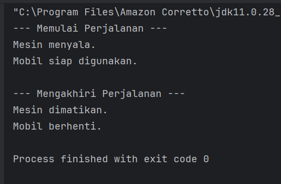
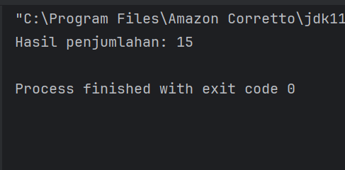
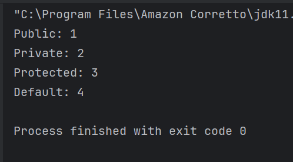
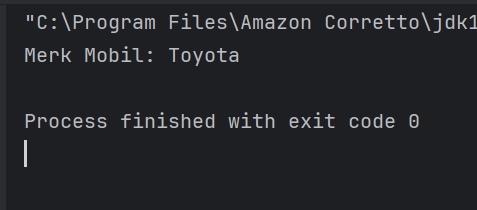
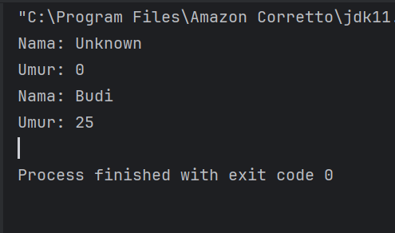
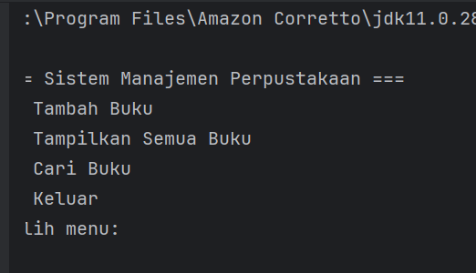

# **Laporan Lab 02: Review Konsep Dasar OOP Menggunakan Java**

**Mata Kuliah:** Praktikum Design Pattern
**Nama:** Rauzatun Jannah
**NIM:** 2024573010064
**Kelas:** TI / 2A

---

# **1. Abstrak**

Pada praktikum ini dilakukan pembelajaran mengenai konsep dasar *Object Oriented Programming* (OOP) menggunakan bahasa Java. Materi yang dipelajari meliputi class, object, attribute, method, akses modifier, setter dan getter, serta constructor. Selain itu, pada akhir praktikum dibuat sebuah program sederhana berupa sistem manajemen perpustakaan untuk mengimplementasikan seluruh konsep tersebut. Dengan praktikum ini, mahasiswa diharapkan mampu memahami dan menerapkan konsep OOP dalam pengembangan program Java.

---

# **2. Praktikum**

---

## **Praktikum 1 – Class dan Object**

### **Dasar Teori**

Class merupakan blueprint atau cetakan untuk membuat objek. Sedangkan object adalah instance dari class yang memiliki atribut (state) dan method (behavior).

### **Langkah Praktikum**

1. Membuat package `modul_2.bagian_1`.
2. Membuat class `Mahasiswa`.
3. Membuat class `Main` untuk menjalankan program.
4. Membuat object dari class dan menampilkan data.

### **Screenshoot Hasil**

*(Tambahkan gambar output di sini)*

### **Analisa dan Pembahasan**

Pada praktikum ini dipelajari bahwa object dibuat dari class. Class berfungsi sebagai template, sedangkan object merupakan implementasinya. Dengan membuat object, kita dapat mengakses atribut dan method yang ada di dalam class.

---

## **Praktikum 2 – Attribute dan Method**

### **Dasar Teori**

Attribute adalah variabel dalam class, sedangkan method adalah fungsi yang mendefinisikan perilaku object.

### **Langkah Praktikum**

1. Membuat package `modul_2.bagian_2`.
2. Membuat class `Kalkulator`.
3. Menambahkan method seperti penjumlahan.
4. Menjalankan program melalui class `Main`.

### **Screenshoot Hasil**

*(Tambahkan gambar output di sini)*

### **Analisa dan Pembahasan**

Attribute digunakan untuk menyimpan data, sedangkan method digunakan untuk mengolah data tersebut. Pada praktikum ini, method digunakan untuk melakukan operasi perhitungan.

---

## **Praktikum 3 – Akses Modifier**

### **Dasar Teori**

Akses modifier digunakan untuk mengatur hak akses terhadap atribut atau method dalam class. Contohnya: `public`, `private`, `protected`, dan `default`.

### **Langkah Praktikum**

1. Membuat package `modul_2.bagian_3`.
2. Membuat class `AksesModifier`.
3. Menguji akses terhadap atribut dari class lain.

### **Screenshoot Hasil**

*(Tambahkan gambar output di sini)*

### **Analisa dan Pembahasan**

Atribut dengan modifier `private` tidak dapat diakses langsung dari luar class. Hal ini bertujuan untuk menjaga keamanan data (*encapsulation*).

---

## **Praktikum 4 – Setter dan Getter**

### **Dasar Teori**

Setter dan getter digunakan untuk mengakses dan mengubah nilai atribut yang bersifat private.

### **Langkah Praktikum**

1. Membuat package `modul_2.bagian_4`.
2. Membuat class `Mobil`.
3. Menambahkan method setter dan getter.
4. Mengakses atribut melalui method tersebut.

### **Screenshoot Hasil**

*(Tambahkan gambar output di sini)*

### **Analisa dan Pembahasan**

Setter digunakan untuk memberi nilai, sedangkan getter untuk mengambil nilai. Ini merupakan implementasi dari konsep encapsulation dalam OOP.

---

## **Praktikum 5 – Constructor**

### **Dasar Teori**

Constructor adalah method khusus yang dipanggil saat object dibuat. Constructor dapat berupa default, parameterized, dan overloading.

### **Langkah Praktikum**

1. Membuat package `modul_2.bagian_5`.
2. Membuat class `Person`.
3. Menggunakan beberapa constructor.
4. Menjalankan program.

### **Screenshoot Hasil**

*(Tambahkan gambar output di sini)*

### **Analisa dan Pembahasan**

Constructor mempermudah inisialisasi object. Dengan constructor overloading, object dapat dibuat dengan berbagai cara sesuai kebutuhan.

---

## **Praktikum 6 – Sistem Manajemen Perpustakaan**

### **Dasar Teori**

Program ini menggabungkan semua konsep OOP seperti class, object, attribute, method, encapsulation, dan constructor dalam satu aplikasi sederhana.

### **Langkah Praktikum**

1. Membuat package `modul_2.bagian_6`.
2. Membuat class:

    * `Buku`
    * `Perpustakaan`
    * `Main`
3. Mengimplementasikan fitur:

    * Tambah buku
    * Tampilkan buku
    * Cari buku

### **Screenshoot Hasil**

*(Tambahkan gambar output di sini)*

### **Analisa dan Pembahasan**

Program ini menunjukkan penerapan OOP secara lengkap. Class `Buku` digunakan sebagai model data, `Perpustakaan` sebagai pengelola data, dan `Main` sebagai interface pengguna. Hal ini menunjukkan pemisahan tanggung jawab (*separation of concerns*).

---

# **3. Kesimpulan**

Dari praktikum yang telah dilakukan, dapat disimpulkan bahwa konsep OOP sangat penting dalam pengembangan program Java. Dengan menggunakan class dan object, program menjadi lebih terstruktur dan mudah dikembangkan. Konsep seperti encapsulation, penggunaan constructor, serta setter dan getter membantu dalam menjaga keamanan data dan fleksibilitas program.

---

# **5. Referensi**

1. Modul Praktikum Design Pattern Lab 02
2. Dokumentasi Resmi Java – [https://docs.oracle.com/javase/tutorial/](https://docs.oracle.com/javase/tutorial/)

---

