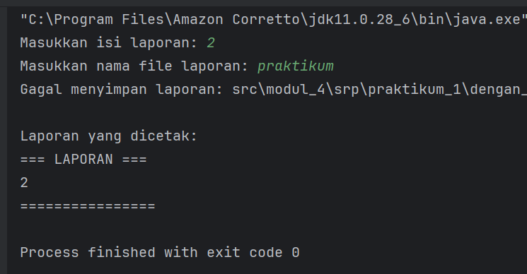
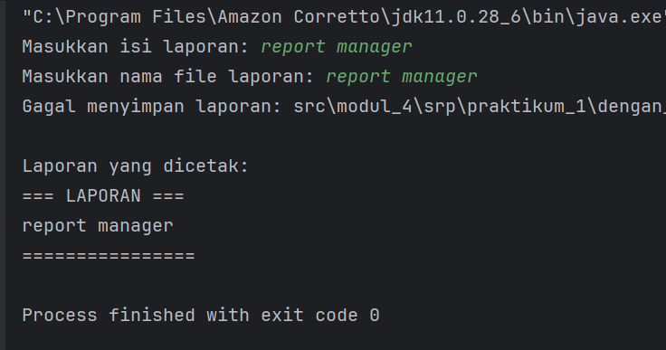
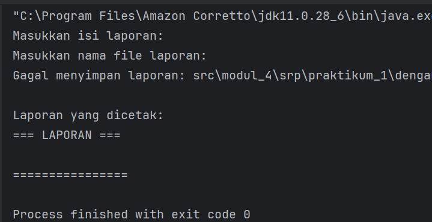
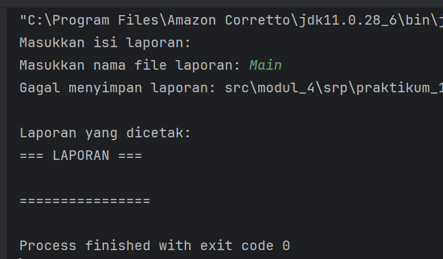

# **LAPORAN LAB 04: SINGLE RESPONSIBILITY PRINCIPLE (SRP)**

Mata Kuliah: Praktikum Design Pattern
Nama: Rauzatun Jannah
NIM: 2024573010064
Kelas: TI / 2A

---

## **1. Abstrak**

Pada praktikum ini dibahas mengenai konsep **Single Responsibility Principle (SRP)** yang merupakan salah satu prinsip dalam SOLID design principle pada pemrograman berorientasi objek. SRP menyatakan bahwa setiap class hanya boleh memiliki satu tanggung jawab atau satu alasan untuk berubah. Tujuan dari praktikum ini adalah untuk memahami penerapan SRP dalam pengembangan perangkat lunak agar kode menjadi lebih terstruktur, mudah dipelihara, dan mudah diuji. Melalui beberapa percobaan, mahasiswa dapat mengidentifikasi pelanggaran SRP serta melakukan refactoring kode agar sesuai dengan prinsip tersebut.

---

## **2. Praktikum**

---

### **Praktikum 1**

#### **Langkah Praktikum**

1. Membuat package `modul_4.praktikum_1.tanpa_srp`
2. Membuat class `ReportManager`
3. Menambahkan fungsi:

    * generate report
    * save report
    * print report
4. Membuat class `Main` untuk menjalankan program
5. Menjalankan program
6. Melakukan refactor ke package `dengan_srp`:

    * ReportGenerator
    * ReportSaver
    * ReportPrinter

---

#### **Screenshoot Hasil**

#### **Analisa dan Pembahasan**

Pada praktikum ini, class `ReportManager` melanggar prinsip SRP karena memiliki lebih dari satu tanggung jawab, yaitu membuat laporan, menyimpan laporan, dan mencetak laporan. Hal ini menyebabkan class menjadi tidak fokus dan sulit dipelihara.

Setelah dilakukan refactoring, setiap tanggung jawab dipisahkan ke dalam class yang berbeda. `ReportGenerator` bertugas membuat laporan, `ReportSaver` bertugas menyimpan laporan, dan `ReportPrinter` bertugas mencetak laporan. Dengan pemisahan ini, kode menjadi lebih modular, mudah dikembangkan, dan lebih mudah diuji.

---

### **Praktikum 2**

#### **Dasar Teori**

Single Responsibility Principle (SRP) adalah prinsip yang menyatakan bahwa setiap class hanya boleh memiliki satu tanggung jawab utama. Dengan menerapkan SRP, perubahan pada satu bagian sistem tidak akan mempengaruhi bagian lainnya secara langsung, sehingga meningkatkan maintainability dan fleksibilitas kode.

---

#### **Langkah Praktikum**

1. Membuat package `modul_4.praktikum_2.tanpa_srp`
2. Membuat class `UserManager`
3. Menjalankan program
4. Melakukan refactoring ke package `dengan_srp`:

    * User
    * UserRepository
    * UserService

---

#### **Screenshoot Hasil**

#### **Analisa dan Pembahasan**

Pada program awal, class `UserManager` memiliki beberapa tanggung jawab sekaligus, yaitu mengelola user, menyimpan data ke database (file), dan mengirim email. Hal ini melanggar prinsip SRP karena satu class menangani banyak fungsi yang berbeda.

Setelah dilakukan refactoring, setiap tanggung jawab dipisahkan menjadi beberapa class. Class `User` hanya menyimpan data user, `UserRepository` bertugas menangani penyimpanan data, dan `UserService` bertugas mengelola logika utama. Dengan struktur ini, kode menjadi lebih bersih, mudah dikembangkan, dan lebih mudah diuji.

---

## **3. Kesimpulan**

Single Responsibility Principle (SRP) sangat penting dalam pengembangan perangkat lunak karena membantu membuat kode lebih terstruktur dan mudah dipelihara. Dengan menerapkan SRP, setiap class memiliki satu tanggung jawab sehingga perubahan pada satu bagian tidak mempengaruhi bagian lain. Hal ini membuat sistem menjadi lebih modular, fleksibel, dan mudah dikembangkan.

---

## **4. Referensi**

* Modul Praktikum Design Pattern – SRP (SOLID Principle)
* Robert C. Martin, *Agile Software Development: Principles, Patterns, and Practices*
* Materi perkuliahan Praktikum Design Pattern

---

