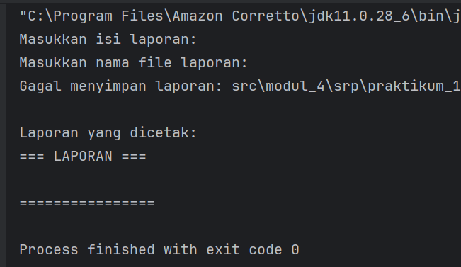
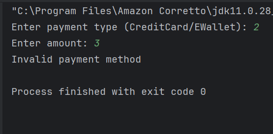
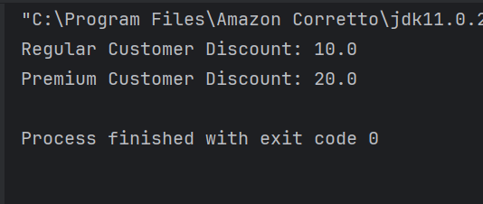
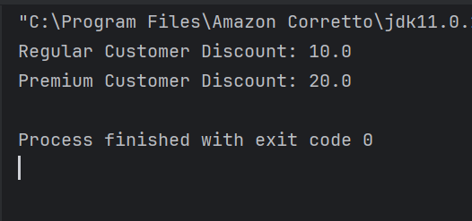
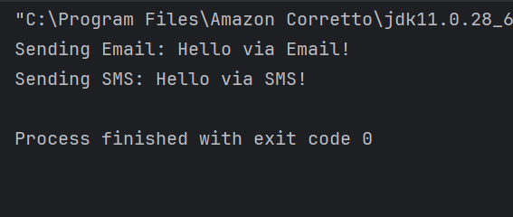
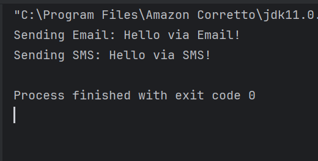

# **LAPORAN LAB 05: SOLID Principle : Open-Closed Principle (OCP)
Mata Kuliah: Praktikum Design Pattern
Nama: Rauzatun Jannah
NIM: 2024573010064
Kelas: TI / 2A

---

## **1. Abstrak**
Praktikum ini bertujuan untuk memahami dan menerapkan salah satu prinsip SOLID yaitu Open-Closed Principle (OCP). OCP menyatakan bahwa suatu entitas perangkat lunak harus terbuka untuk pengembangan (extension) tetapi tertutup untuk modifikasi (modification). Dalam praktikum ini dilakukan analisis terhadap beberapa contoh program yang melanggar prinsip OCP, kemudian dilakukan refactoring menggunakan interface dan polimorfisme agar program dapat diperluas tanpa mengubah kode yang sudah ada. Implementasi OCP dilakukan pada sistem pembayaran, sistem perhitungan diskon, dan sistem notifikasi. Hasil praktikum menunjukkan bahwa penerapan OCP menghasilkan kode yang lebih fleksibel, modular, mudah diuji, dan mudah dikembangkan.

## **2. Praktikum**
### **Praktikum 1**.
#### **Langkah Praktikum**
1.Membuat package modul_5.praktikum_1.tanpa_ocp.

2.Membuat class PaymentProcessor.

3.Membuat class Main.

4.Menjalankan program dan mengamati hasilnya.

5.Membuat package modul_5.praktikum_1.dengan_ocp.

6.Membuat interface PaymentMethod.

7.Membuat class CreditCardPayment.

8.Membuat class EWalletPayment.

9.Membuat class PaymentProcessor.

10.Membuat class Main.

11.Menjalankan program hasil refactoring.
#### **Screenshoot Hasil**

#### **Analisa dan Pembahasan**
Pada implementasi tanpa OCP, metode pembayaran ditentukan menggunakan percabangan seperti if-else. Ketika terdapat metode pembayaran baru, maka kode pada class PaymentProcessor harus diubah. Hal ini melanggar prinsip Open-Closed Principle.

Setelah dilakukan refactoring, digunakan interface PaymentMethod yang diimplementasikan oleh berbagai metode pembayaran seperti CreditCardPayment dan EWalletPayment. Dengan pendekatan ini, penambahan metode pembayaran baru dapat dilakukan dengan membuat class baru tanpa mengubah kode PaymentProcessor.

Keuntungan yang diperoleh:

Kode lebih fleksibel.
Mudah menambahkan metode pembayaran baru.
Mengurangi risiko kesalahan pada kode lama.
Mempermudah pengujian setiap metode pembayaran.
---

### **Praktikum 2**
#### **Dasar Teori**
Open-Closed Principle memungkinkan sistem diperluas tanpa memodifikasi kode yang sudah ada. Salah satu cara penerapannya adalah menggunakan interface dan polimorfisme sehingga perilaku program dapat ditambahkan melalui implementasi baru.
#### **Langkah Praktikum**
1.Membuat package modul_5.praktikum_2.tanpa_ocp.

2.Membuat class DiscountCalculator.

3.Membuat class Main.

4.Menjalankan program.

5.Membuat package modul_5.praktikum_2.dengan_ocp.

6.Membuat interface Discount.

7.Membuat class RegularDiscount.

8.Membuat class PremiumDiscount.

9.Membuat class DiscountCalculator.

10.Membuat class Main.

11.Menjalankan program hasil refactoring.

#### **Screenshoot Hasil**

#### **Analisa dan Pembahasan**
Pada kode awal, jenis diskon ditentukan melalui percabangan berdasarkan tipe pelanggan. Jika terdapat tipe pelanggan baru, maka method calculateDiscount harus dimodifikasi.

Untuk memenuhi OCP, dibuat interface Discount yang diimplementasikan oleh class RegularDiscount dan PremiumDiscount. Class DiscountCalculator hanya berinteraksi dengan interface sehingga tidak bergantung pada implementasi tertentu.

Keuntungan penerapan OCP:

Penambahan jenis diskon baru tidak memerlukan perubahan pada DiscountCalculator.
Struktur program menjadi lebih modular.
Pengujian setiap jenis diskon dapat dilakukan secara terpisah.
Pemeliharaan kode menjadi lebih mudah.
### **Praktikum 3**
#### **Dasar Teori**
Prinsip OCP dapat diterapkan pada sistem notifikasi dengan memisahkan setiap jenis notifikasi ke dalam class yang berbeda melalui interface. Dengan demikian, penambahan jenis notifikasi baru tidak memerlukan perubahan pada sistem yang sudah ada.

#### **Langkah Praktikum**
1.Membuat package modul_5.praktikum_3.tanpa_ocp.

2.Membuat class NotificationService.

3.Membuat class Main.

4.Menjalankan program.

5.Membuat package modul_5.praktikum_3.dengan_ocp.

6.Membuat interface Notifier.

7.Membuat class EmailNotifier.

8.Membuat class SMSNotifier.

9.Membuat class NotificationService.

10.Membuat class Main.

11.Menjalankan program hasil refactoring.

#### **Screenshoot Hasil**

#### **Analisa dan Pembahasan**
Pada implementasi awal, jenis notifikasi ditentukan menggunakan percabangan pada NotificationService. Penambahan notifikasi baru seperti WhatsApp atau Telegram mengharuskan perubahan pada class tersebut sehingga melanggar OCP.

Setelah refactoring, dibuat interface Notifier yang menjadi kontrak bagi setiap jenis notifikasi. Class NotificationService hanya menggunakan interface tersebut tanpa mengetahui implementasinya.

Keuntungan yang diperoleh:

Mudah menambahkan notifikasi baru.
Mengurangi ketergantungan antar class.
Kode lebih terorganisir dan mudah dipelihara.
Mempermudah pengembangan sistem di masa depan.

## **3. Kesimpulan**
Pada implementasi awal, jenis notifikasi ditentukan menggunakan percabangan pada NotificationService. Penambahan notifikasi baru seperti WhatsApp atau Telegram mengharuskan perubahan pada class tersebut sehingga melanggar OCP.

Setelah refactoring, dibuat interface Notifier yang menjadi kontrak bagi setiap jenis notifikasi. Class NotificationService hanya menggunakan interface tersebut tanpa mengetahui implementasinya.

Keuntungan yang diperoleh:

Mudah menambahkan notifikasi baru.
Mengurangi ketergantungan antar class.
Kode lebih terorganisir dan mudah dipelihara.
Mempermudah pengembangan sistem di masa depan.

## **4. Referensi**
Martin, Robert C. Agile Software Development: Principles, Patterns, and Practices. Prentice Hall, 2003.
Meyer, Bertrand. Object-Oriented Software Construction. Prentice Hall, 1988.
Modul Praktikum Design Pattern – SOLID Principle: Open-Closed Principle (OCP), Politeknik Negeri Lhokseumawe.
Oracle Java Documentation, https://docs.oracle.com/javase/

