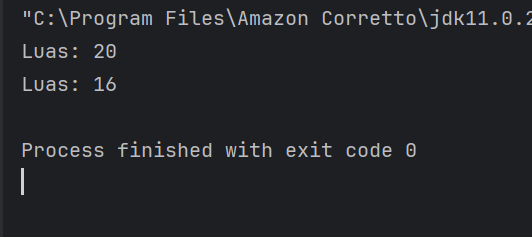
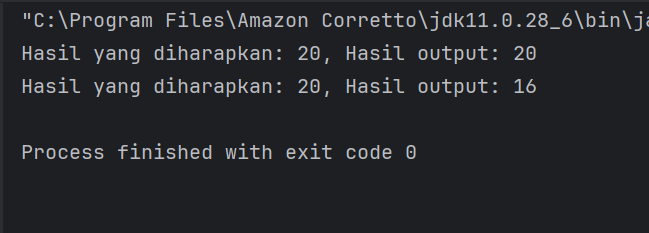
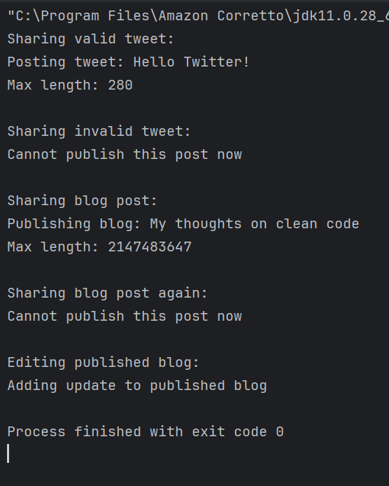
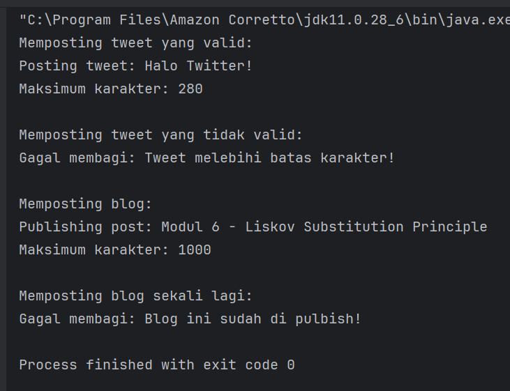
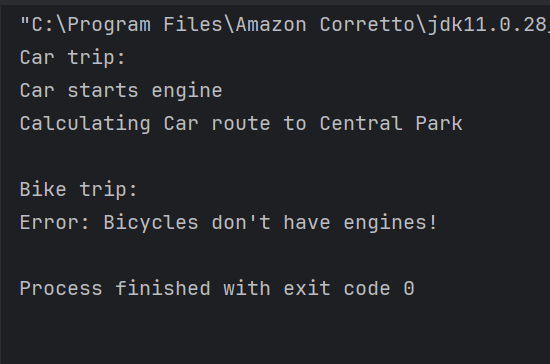

# **Laporan Lab 06: 
**Mata Kuliah:** Praktikum Design Pattern
**Nama:** Rauzatun Jannah
**NIM:** 2024573010064
**Kelas:** TI / 2A

---

# **1. Abstrak**
Liskov Substitution Principle (LSP) merupakan prinsip ketiga dari akronim SOLID dalam pemrograman berorientasi objek (OOP) yang dicetuskan oleh Barbara Liskov. Prinsip ini menegaskan bahwa objek dari suatu subclass harus dapat menggantikan objek dari superclass tanpa mengubah kebenaran atau perilaku dasar dari program tersebut. Pelanggaran LSP umumnya terjadi ketika sebuah hierarki pewarisan (inheritance) memaksa subclass mengimplementasikan metode yang tidak relevan, memodifikasi kontrak dasar secara ekstrem, atau melemparkan pengecualian tak terduga (runtime exception).

# **2. Praktikum**
## Praktikum 1 – Rectangle-Square Problem
### **Dasar Teori**
Rectangle-Square Problem adalah contoh klasik pelanggaran LSP. Secara matematis, sebuah Persegi (Square) adalah bentuk khusus dari Persegi Panjang (Rectangle). Namun, dalam desain OOP, jika Square mewarisi properti dan metode Rectangle, hubungan ini menjadi rusak. Rectangle berasumsi bahwa panjang (length) dan lebar (width) dapat diubah secara independen. Sedangkan Square memaksakan aturan bahwa jika panjang diubah, lebar harus ikut berubah. Ketika subclass merusak asumsi perilaku dari superclass, maka prinsip LSP telah dilanggar.

### Langkah Praktikum
1.Membuat sebuah package baru di dalam modul_6/praktikum_1 dengan nama tanpa_lsp.

2.Membuat class Rectangle sebagai kelas induk yang memiliki atribut width dan height, lengkap dengan metode getter-setter mandiri serta fungsi kalkulasi luas calculateArea().

3.Membuat class Square sebagai turunan (subclass) dari Rectangle. Di dalam kelas ini, dilakukan override pada metode setWidth() dan setHeight() agar setiap kali satu sisi diubah, sisi lainnya ikut menyesuaikan secara otomatis demi mempertahankan sifat persegi.

4.Membuat class Main yang berisi fungsi pengujian testRectangle(Rectangle r). Fungsi ini sengaja memanipulasi nilai lebar ke angka 5 dan tinggi ke angka 4 secara independen untuk menguji konsistensi objek.

5.Menjalankan program utama menggunakan instansiasi objek Rectangle asli dan objek Square yang disubstitusikan ke dalam tipe Rectangle.
### Screenshoot Hasil

### Analisa dan Pembahasan
ada versi tanpa_lsp, method testRectangle dirancang dengan asumsi kontrak dasar Rectangle: mengubah nilai tinggi tidak akan mempengaruhi lebar. Namun ketika objek diganti menjadi Square, pemanggilan r.setHeight(4) secara tidak sengaja mengubah lebar menjadi 4. Hasil kalkulasi menjadi $4 \times 4 = 16$ (Salah dari sudut pandang kontrak Rectangle). Ini merusak program karena substitusi objek gagal menjaga kestabilan perilaku.Solusi perbaikannya adalah memutus hubungan pewarisan antara Rectangle dan Square. Keduanya dielevasi menjadi sejajar dan mengimplementasikan sebuah interface bernama Shape. Dengan cara ini, polimorfisme tetap berjalan melalui method calculateArea() tanpa ada pihak yang dipaksa mewarisi properti yang tidak sesuai dengan hakikat perilakunya.

## Praktikum 2 – Sistem Posting Media Sosial
### Dasar Teori
Pelanggaran LSP sering kali terdeteksi apabila sebuah subclass melempar exception yang tidak terduga pada metode turunan, atau mengubah pre-condition menjadi lebih ketat. Hal ini membuat fungsi pemanggil (client code) harus bersusah payah mengetahui detail implementasi spesifik dari masing-masing subclass dengan menggunakan blok try-catch yang berlebih.

### Langkah Praktikum
1.Membuat package baru di dalam modul_6/praktikum_2 bernama tanpa_lsp.

2.Membuat superclass SocialMediaPost yang menampung atribut konten teks dan metode bawaan publish().

3.Membuat subclass TwitterPost yang memaksakan aturan ketat berupa pelemparan IllegalArgumentException apabila teks konten yang dimasukkan melampaui batas 280 karakter saat metode publish() dieksekusi.

4.Membuat subclass BlogPost yang memaksakan status boolean isPublished dan melemparkan IllegalStateException jika pengguna mencoba menerbitkan ulang postingan yang sudah aktif.

5.Membuat kelas pengujian Main dengan metode sharePost(SocialMediaPost post) untuk membuktikan bahwa struktur polimorfisme ini tidak aman dan rentan mengalami crash runtime jika tidak dibungkus dengan penanganan error yang spesifik.
### Screenshoot Hasil

### Analisa dan Pembahasan
Pada desain pertama, sharePost dipaksa menghadapi runtunan penolakan berupa runtime error yang dilempar secara sepihak oleh objek turunan. Proses refactoring menyelamatkan rancangan ini dengan memperkenalkan operasi pemeriksaan kondisi (canPublish() dan getMaxContentLength()) ke dalam kontrak interface Publishable. Kini client code dapat memperlakukan seluruh objek secara seragam tanpa perlu menebak-nebak tipe konkretnya di dalam blok penanganan error.

## Praktikum 3 – Latihan: Aplikasi Sistem Navigasi Kendaraan
### Dasar Teori
Pada kasus latihan ini, terdapat pelanggaran fundamental di mana kelas dasar sebelumnya berasumsi bahwa seluruh kendaraan di dunia menggunakan mesin (startEngine()). Ketika kelas Bicycle (Sepeda) dipaksa diturunkan dari kelas kendaraan tersebut, ia harus mengimplementasikan fungsi mesin yang tidak dimilikinya secara fisis, sehingga merusak kesahihan polimorfisme.

### Langkah Praktikum
1.Membuat sebuah package baru bernama latihan di dalam direktori modul_6.

2.Membuat sebuah interface paling dasar bernama Navigable yang murni hanya bertanggung jawab atas fungsi pemetaan rute perjalanan melalui metode createRoute().

3.Membuat interface turunan khusus bernama MotorizedVehicle yang memperluas (extends) interface Navigable dengan tambahan kontrak fungsional mesin yaitu startEngine().

4.Mengimplementasikan class Car secara patuh di bawah kendali interface MotorizedVehicle, karena mobil memiliki mesin sekaligus membutuhkan navigasi rute jalan raya.

5.Mengimplementasikan class Bicycle secara langsung di bawah interface Navigable, sehingga sepeda dibebaskan dari kewajiban mengelola fungsi mesin yang tidak relevan dengan fisiknya.

6.Membuat skenario eksekusi pada class Main dengan mengelompokkan berbagai objek ke dalam koleksi List<Navigable> untuk membuktikan keamanan substitusi objek saat pemanggilan metode navigasi.
### Screenshoot Hasil

### Analisa dan Pembahasan
Awalnya, program latihan melanggar LSP karena objek Bicycle tidak mampu menggantikan fungsi kelas dasar kendaraan tanpa merusak ekspektasi program (memaksa mengeluarkan pesan tidak relevan atau error saat mesin dinyalakan). Melalui refactoring, perilaku navigasi dipisah ke dalam interface fundamental Navigable. Komponen kendaraan bermesin diekstrak ke dalam sub-interface khusus MotorizedVehicle. Hasilnya, Bicycle dibebaskan dari kewajiban memilik mesin, namun ia tetap dapat diproses di dalam sistem navigasi secara polimorfis bersama objek Car.

# **3. Kesimpulan**
Berdasarkan serangkaian percobaan praktikum yang telah diselesaikan, dapat disimpulkan bahwa:
Liskov Substitution Principle (LSP) menuntut konsistensi perilaku dalam hierarki pewarisan kelas. Subclass tidak boleh memperketat aturan pre-condition atau melonggarkan post-condition dari kelas induknya.
Pelanggaran LSP paling sering dijumpai ketika kita terlalu tergesa-gesa memakai relasi pewarisan (IS-A Relationship) hanya demi memakai ulang kode (code reuse), padahal fungsionalitas aslinya sudah jauh berbeda.
Mengganti relasi pewarisan (inheritance) menjadi komposisi (composition) atau memecah komponen ke dalam struktur interface yang ramping terbukti sangat efektif untuk meluruskan pelanggaran prinsip LSP. Dengan desain yang mematuhi LSP, kode program menjadi jauh lebih stabil, terhindar dari runtime exception yang tak terduga, dan sangat adaptif terhadap ekstensi fungsionalitas baru di masa depan.

# **5. Referensi**

Martin, Robert C. (2000). Design Principles and Design Patterns. CleanCoder.

Liskov, B. (1987). Data Abstraction and Hierarchy. SIGPLAN Notices.

Zulman, Muhammad Reza. (2026). Modul 6: SOLID Principle - Liskov Substitution Principle (LSP). Lhokseumawe: Politeknik Negeri Lhokseumawe.

