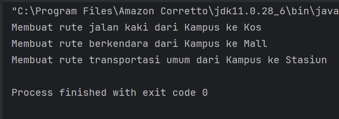
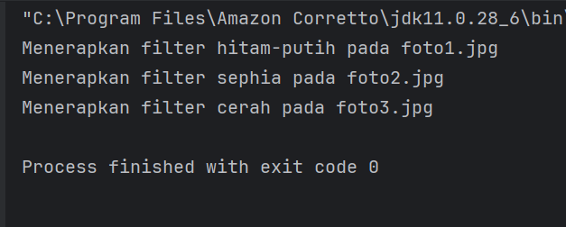
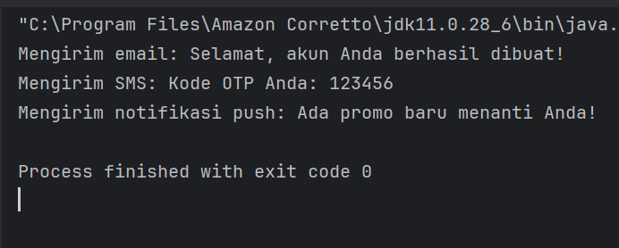
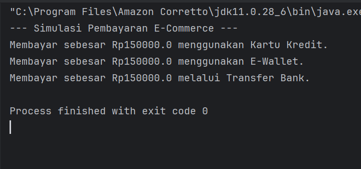

# **Laporan Lab 09:Strategy Pattern
**Mata Kuliah:** Praktikum Design Pattern
**Nama:** Rauzatun Jannah
**NIM:** 2024573010064
**Kelas:** TI / 2A

---

# **1. Abstrak**
Praktikum ini membahas mengenai implementasi Strategy Pattern, salah satu behavioral design pattern yang digunakan untuk mendefinisikan keluarga algoritma, mengenkapsulasi masing-masing algoritma, dan membuatnya dapat saling bertukar secara dinamis pada saat program berjalan (runtime). Keunggulan utama dari pola ini adalah kemampuannya untuk memisahkan logika eksekusi (how to do) dari kelas pengguna (context), sehingga memenuhi prinsip Open/Closed Principle dalam pemrograman berorientasi objek. Melalui serangkaian praktikum ini, diimplementasikan fungsionalitas sistem navigasi, filter foto, dan sistem layanan notifikasi multisaluran menggunakan bahasa pemrograman Java.

# **2. Praktikum**
## **Praktikum 1 –Program Navigasi Sederhana
### **Dasar Teori**
Sistem navigasi sering kali membutuhkan kalkulasi rute yang berbeda tergantung pada preferensi pengguna (misalnya: jalan kaki, berkendara, atau kendaraan umum). Dibandingkan menggunakan struktur percabangan (if-else atau switch-case) yang kompleks di dalam satu kelas, Strategy Pattern mendelegasikan kalkulasi rute tersebut ke objek strategi yang terpisah melalui sebuah interface bersama (RouteStrategy).

### **Langkah Praktikum**
1.Membuat package modul_9.praktikum_1.

2.Membuat interface RouteStrategy dengan metode abstrak untuk menghitung rute.

3.Membuat Concrete Strategy berupa class WalkingRoute, DrivingRoute, dan PublicTransportRoute yang mengimplementasikan RouteStrategy.

4.Membuat class Context berupa Navigator yang memuat referensi ke interface RouteStrategy dan menyediakan metode setter untuk mengubah rute secara dinamis.

5.Membuat class Main untuk menjalankan simulasi navigasi.
### **Screenshoot Hasil**

### **Analisa dan Pembahasan**
Pada praktikum ini, class Navigator bertindak sebagai Context yang tidak memedulikan bagaimana detail dari pencarian rute dilakukan. Ketika pengguna memanggil metode untuk berpindah rute, runtime akan mengeksekusi implementasi konkret dari sub-class strategi yang aktif. Struktur ini membuat aplikasi sangat mudah dikembangkan seandainya di masa mendatang terdapat rute tambahan seperti rute sepeda (CyclingRoute).

## **Praktikum 2 –Program Filter Foto Sederhana
### **Dasar Teori**
Pengolahan citra digital di aplikasi penyunting foto membutuhkan pergantian efek secara dinamis. Dengan Strategy Pattern, setiap algoritma manipulasi piksel (seperti Sephia, Bright, atau Black & White) dibungkus menjadi sebuah objek terpisah yang seragam di bawah satu kontrak interface.

### **Langkah Praktikum**
1.Membuat package modul_9.praktikum_2.

2.Membuat interface FilterStrategy yang mendefinisikan fungsi penerapan filter foto.

3.Mengimplementasikan konkret strategi melalui class BlackWhiteFilter, SepiaFilter, dan BrightFilter.

4.Membuat class PhotoEditor sebagai Context untuk menampung gambar dan memproses filter pilihan pengguna.

5.Membuat class Main untuk menguji perubahan filter pada foto secara dinamis.
### **Screenshoot Hasil**

### **Analisa dan Pembahasan**
Penerapan Strategy Pattern pada pengeditan foto berhasil menghilangkan ketergantungan langsung antara fungsionalitas UI aplikasi (PhotoEditor) dengan logika matematika pemrosesan gambar. Setiap filter berdiri sendiri, mempermudah pengujian unit (unit testing) untuk masing-masing algoritma filter tanpa perlu mengkhawatirkan state dari komponen editor lainnya.

## **Praktikum 3 –Program Notifikasi
### **Dasar Teori**
Sistem aplikasi modern dituntut mampu mengirim pesan melalui berbagai saluran komunikasi (Email, SMS, Push Notification) secara adaptif. Pola strategi memisahkan mesin pengirim pesan (Notification Service) dari infrastruktur jaringan atau format pesan spesifik tiap saluran penyedia.

### **Langkah Praktikum**
1.Membuat package modul_9.praktikum_3.

2.Membuat interface NotificationStrategy beserta metode void send(String message).

3.Membuat kelas konkret pengirim pesan: EmailNotification dan PushNotification (sesuai dengan berkas kode sumber yang diunggah).

4.Menyusun kelas konteks NotificationService yang memiliki atribut strategy beserta setter methodnya.

5.Membuat kelas penguji Main untuk mensimulasikan pengiriman pesan.

### **Screenshoot Hasil**

### **Analisa dan Pembahasan**

Berdasarkan kode di atas, NotificationService dapat memakai strategi pengiriman pesan apa pun selama ia mengimplementasikan NotificationStrategy. Kelebihannya, apabila terjadi penambahan metode komunikasi baru seperti SMSNotification atau WhatsAppNotification, kita cukup membuat kelas baru yang mengimplementasikan interface tersebut tanpa perlu mengutak-atik kode yang ada di dalam kelas NotificationService

## **Praktikum 4-Soal Latihan : Program Pembayaran E-Commerce
### **Dasar Teori**
Transaksi checkout pada aplikasi e-commerce menuntut adanya integrasi dengan multi-payment gateway. Pola strategi sangat cocok diterapkan di sini agar sistem inti penjualan tidak terikat pada satu vendor pembayaran saja.

### **Langkah Praktikum**
1.Membuat package modul_9.latihan.praktikum.

2.Menulis berkas interface PaymentStrategy dengan method pay(double amount).

3.Membuat tiga kelas implementasi metode pembayaran secara konkret: CreditCardPayment, EWalletPayment, dan BankTransferPayment.

4.Membuat kelas konteks utama bernama Checkout.

5.Membuat kelas eksekusi Main untuk menguji skenario pembayaran dengan nilai nominal tertentu.
### **Screenshoot Hasil**

### **Analisa dan Pembahasan**
Sistem berhasil mengisolasi data pembayaran (seperti nomor kartu kredit atau saldo e-wallet) di dalam kelas strateginya masing-masing. Objek Checkout hanya fokus pada proses kalkulasi belanjaan dan mendelegasikan tugas pemotongan saldo sepenuhnya ke objek pembayaran eksternal yang dimasukkan lewat runtime.

# **3. Kesimpulan**

Melalui seluruh kegiatan praktikum pada Lab 09 ini, dapat disimpulkan bahwa:

Strategy Pattern sangat efektif dalam mereduksi kompleksitas kondisional kode (if-else bercabang) yang rawan terhadap kesalahan ketik (human error) dan sulit dipelihara.

Pola ini mematuhi prinsip Open/Closed Principle, di mana sebuah sistem terbuka untuk perluasan fitur (menambah strategi baru) namun tertutup terhadap modifikasi fungsionalitas yang sudah mapan (existing code).

Kerugian dari pola ini adalah meningkatnya jumlah total berkas kelas dalam struktur proyek kerja perangkat lunak karena setiap algoritma harus dideklarasikan ke dalam satu berkas kelas terpisah.

# **5. Referensi**
Gamma, E., Helm, R., Johnson, R., & Vlissides, J. (1994). Design Patterns: Elements of Reusable Object-Oriented Software. Addison-Wesley.

Freeman, E., Robson, E., Sierra, K., & Bates, B. (2004). Head First Design Patterns. O'Reilly Media.

Modul Praktikum Design Pattern - Lab 09: Strategy Pattern, Jurusan TIK Politeknik Negeri Lhokseumawe.

